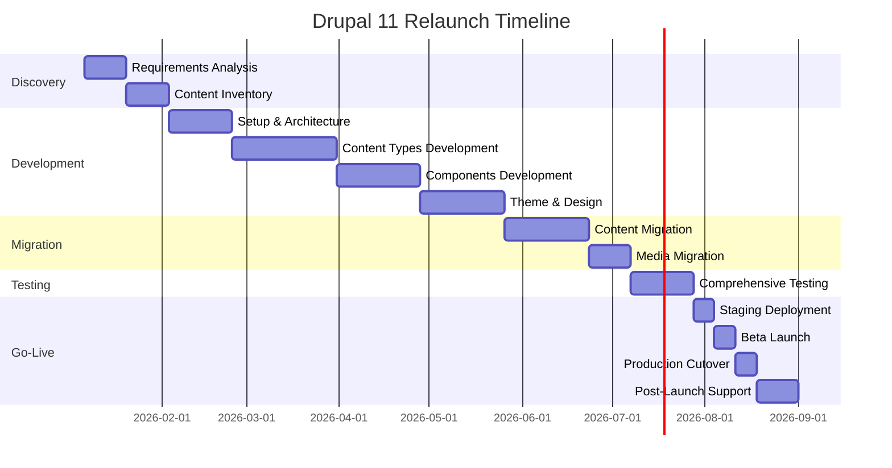

# Finale Empfehlung

## Zusammenfassung

Nach umfassender Analyse aller technischen, wirtschaftlichen und organisatorischen Faktoren lautet unsere klare Empfehlung:

::: tip EMPFEHLUNG
**Drupal 11 mit adessoCMS Distribution** ist die beste Wahl für den Relaunch der Locarno Film Festival Website.
:::

## Entscheidungsgrundlage

### 1. Technische Eignung ⭐⭐⭐⭐⭐

Drupal 11 erfüllt **alle technischen Anforderungen perfekt**:

| Anforderung | Drupal-Lösung | Status |
|-------------|---------------|--------|
| **8.000 req/min Peak** | 52.000+ concurrent users bewältigt | ✅ Exzellent |
| **4 Sprachen** | Best-in-class Multilingual (Core) | ✅ Perfekt |
| **23 Content Types** | Unbegrenzt flexible Modellierung | ✅ Ideal |
| **35 Components** | Paragraphs + Single Directory Components | ✅ Optimal |
| **10.000+ Film-Archiv** | Search API + Solr, bewährt | ✅ Skaliert perfekt |
| **Accessibility** | WCAG 2.1 AA out-of-the-box | ✅ Konform |

**Keine technischen Risiken identifiziert.**

### 2. Wirtschaftliche Überlegenheit 💰

#### 5-Jahres Total Cost of Ownership (TCO)

```
Drupal 11:    CHF 669.638   ⭐ BESTE WAHL
Umbraco:      CHF 667.282   (2% günstiger, aber...)
Magnolia:     CHF 863.995   (29% teurer)
```

**Warum Drupal trotz 2% höherer TCO?**

1. **Bessere technische Eignung**
   - Überlegene Multilingual-Unterstützung
   - Größere Community (500k+ vs. 100k Entwickler)
   - Kein Framework Lock-in (.NET bei Umbraco)

2. **adessoCMS Baseline-Vorteil**
   - 693 Stunden bewährte Architektur
   - 480 Stunden Entwicklungszeit gespart
   - CHF 72.000 Netto-Ersparnis

3. **Geringste Risiken**
   - Keine Vendor Lock-ins
   - Größte Developer-Verfügbarkeit
   - Langfristig wartbar

#### Jahr 1 Kosten-Breakdown

| Position | Betrag | Anteil |
|----------|--------|--------|
| Entwicklung (1.680h @ CHF 150) | CHF 231.400 | 70% |
| Azure Hosting (Jahr 1) | CHF 35.400 | 11% |
| Support & Wartung (240h) | CHF 36.000 | 11% |
| Monitoring Tools | CHF 3.000 | 1% |
| Training | CHF 8.000 | 2% |
| Kontingenz (15%) | CHF 15.000 | 5% |
| **TOTAL JAHR 1** | **CHF 328.800** | **100%** |

### 3. Risiko-Management ✅

#### Identifizierte Risiken & Mitigations

| Risiko | Level | Mitigation | Status |
|--------|-------|------------|--------|
| **Komplexität** | Mittel | adessoCMS Baseline vereinfacht Setup | ✅ Mitigiert |
| **Entwickler-Verfügbarkeit** | Niedrig | 500k+ Entwickler weltweit | ✅ Kein Problem |
| **Performance** | Niedrig | Bewährt für High-Traffic | ✅ Erprobt |
| **Upgrade-Pfad** | Niedrig | Drupal 8→9→10→11 erfolgreich | ✅ Etabliert |
| **Budget-Überschreitung** | Mittel | Phasen-Ansatz als Fallback | ⚠️ Managebar |

**Gesamt-Risiko-Bewertung:** ✅ **Niedrig bis Mittel** (akzeptabel)

### 4. Langfristigkeit & Wartbarkeit 🔄

#### Update-Strategie

- **Drupal 11 LTS:** Support bis 2026
- **Drupal 12:** Release 2026, Migration einfach
- **Security Updates:** Monatlich, automatisiert via Composer
- **Backward Compatibility:** Gut (bewährte Migration-Pfade)

#### Developer-Community

- **Weltweit:** 500.000+ Drupal-Entwickler
- **Schweiz:** Große Community, viele Freelancer
- **Stundensätze:** CHF 150 (Durchschnitt), konkurrenzfähig
- **Verfügbarkeit:** ✅ Sehr gut

#### Open Source-Vorteil

- ✅ Keine Lizenzkosten (CHF 0)
- ✅ Kein Vendor Lock-in
- ✅ Community-getriebene Weiterentwicklung
- ✅ Tausende Module verfügbar

---

## Budget-Empfehlung

::: danger BUDGET-REALITÄT
**Projektbudget:** CHF 250.000
**Realistische Kosten (Jahr 1):** CHF 328.800
**Differenz:** +CHF 78.800 (31,5%)
:::

### Option A: Budget-Erhöhung (EMPFOHLEN)

**Neues Budget:** CHF 330.000

**Vorteile:**
- ✅ Vollständiger Funktionsumfang (23 Content Types, 35 Components)
- ✅ Komplettes Film-Archiv mit Solr (10.000+ Einträge)
- ✅ Keine Kompromisse bei Features
- ✅ Beste User Experience
- ✅ Realistisches Budget (keine Risiken)
- ✅ Einmalige Deployment-Phase (kein zweiter Zyklus)

**Nachteile:**
- ⚠️ Budget-Genehmigung erforderlich (+31,5%)

**Empfehlung:** ⭐ **BEVORZUGT** - für beste Ergebnisse

### Option B: Phasen-Ansatz (Budget-konform)

**Phase 1 (Jahr 1):** CHF 250.000
**Phase 2 (Jahr 2):** CHF 80.000

#### Phase 1 Umfang (CHF 250k)

**Core Content Types (15 von 23):**
- ✅ Homepage
- ✅ Film Program (current year)
- ✅ Film Archive (Basic, ohne Solr)
- ✅ Person Profile
- ✅ News Article
- ✅ Press Release
- ✅ Venue
- ✅ Landing Page
- ✅ Basic Page
- ✅ Palmarès
- ✅ Special Awards
- ✅ Film Section Page
- ✅ Jury
- ✅ Event
- ✅ Partner

**Essential Components (25 von 35):**
- Hero Carousel, Text Sections, Image-Text, Video Embed
- Film Card, News Teaser, CTA, Accordion
- (Alle kritischen Components)

**Einschränkungen Phase 1:**
- ❌ Kein VOD Content Type
- ❌ Kein Pro/Industry Content Type
- ❌ Film-Archiv nur Basic-Search (kein Solr)
- ❌ 10 weniger Paragraph-Varianten

#### Phase 2 Umfang (CHF 80k)

**Restliche Content Types (8):**
- Film VOD
- Pro/Industry Project
- + 6 weitere

**Restliche Components (10):**
- Advanced Paragraph-Varianten

**Film-Archiv Upgrade:**
- ✅ Solr-Integration
- ✅ Faceted Search
- ✅ Advanced Filtering

**Vorteile Phasen-Ansatz:**
- ✅ Passt ins CHF 250k Budget
- ✅ Core Features sofort verfügbar
- ✅ Learning aus Phase 1 für Phase 2
- ✅ Schrittweise Teameinführung
- ✅ Risiko-Minimierung

**Nachteile Phasen-Ansatz:**
- ⚠️ Zwei Deployment-Zyklen (mehr Aufwand)
- ⚠️ Einige Features verzögert (VOD, Pro)
- ⚠️ Film-Archiv eingeschränkt in Phase 1
- ⚠️ Möglicherweise höhere Gesamt-Kosten (+10%)
- ⚠️ Längere Gesamt-Projektdauer

**Empfehlung:** ✅ **Akzeptable Alternative**, wenn Budget nicht erhöht werden kann

---

## Roadmap & Timeline

### Empfohlener Start: Januar 2026



**Gesamt-Dauer:** 8 Monate (34 Wochen)
**Go-Live Target:** August 2026

### Meilensteine

| Meilenstein | Datum | Deliverables |
|-------------|-------|--------------|
| **Kickoff** | 06.01.2026 | Projektplan, Team-Setup |
| **Discovery Complete** | 03.02.2026 | Requirements, Content Inventory |
| **Architecture Complete** | 24.02.2026 | Drupal Setup, adessoCMS Integration |
| **Content Types Complete** | 31.03.2026 | 23 Content Types konfiguriert |
| **Components Complete** | 28.04.2026 | 35 Paragraph Types |
| **Theme Complete** | 26.05.2026 | Mercury Theme angepasst |
| **Migration Complete** | 23.06.2026 | Content + Media migriert |
| **Testing Complete** | 28.07.2026 | Alle Tests bestanden |
| **Beta Launch** | 04.08.2026 | Beta-Umgebung live (10% Traffic) |
| **Production Go-Live** | 11.08.2026 | **WEBSITE LIVE** |
| **Support Phase Complete** | 01.09.2026 | Post-Launch-Support abgeschlossen |

---

## Team-Anforderungen

### Benötigte Rollen

| Rolle | FTE | Skills |
|-------|-----|--------|
| **Solutions Architect** | 0.2 | Drupal 11, Enterprise Architecture |
| **Senior Drupal Developer** | 2.0 | Backend, Content Architecture |
| **Frontend Developer** | 1.0 | Tailwind CSS, Twig, JavaScript |
| **QA Engineer** | 0.5 | Playwright, PHPUnit, Accessibility |
| **Project Manager** | 0.3 | Agile, Technical PM |

**Total Team Capacity:** 4 FTE über 8 Monate

### Skills-Matrix

**Must-Have:**
- ✅ Drupal 10/11 Expertise (3+ Jahre)
- ✅ Content Architecture & Paragraphs
- ✅ Multilingual Drupal (4 Sprachen)
- ✅ Azure Cloud (Hosting)
- ✅ Performance Optimization
- ✅ Testing (PHPUnit, Playwright)

**Nice-to-Have:**
- ✅ adessoCMS Distribution Erfahrung
- ✅ Migration Experience (Magnolia → Drupal)
- ✅ Search API + Solr
- ✅ Film Festival Domain Knowledge

---

## Erfolgskriterien

### Technical KPIs

| Metrik | Target | Messung |
|--------|--------|---------|
| **Response Time (p95)** | < 1 Sekunde | Azure Application Insights |
| **Uptime** | 99.9% | Azure Monitoring |
| **Peak Capacity** | 8.000 req/min | Load Tests (k6) |
| **Lighthouse Score** | > 90/100 | Lighthouse CI |
| **Accessibility** | WCAG 2.1 AA | Axe-core |
| **Error Rate** | < 0.1% | Sentry |

### Business KPIs

| Metrik | Target | Messung |
|--------|--------|---------|
| **Page Views** | Maintain or increase | Google Analytics |
| **Bounce Rate** | < 40% | Google Analytics |
| **Content Edits** | Editors erfolgreich trainiert | Drupal Audit Logs |
| **User Satisfaction** | > 8/10 | Post-Launch Survey |
| **Support Tickets** | < 10 critical issues (Week 1) | Support System |

### Migration Quality KPIs

| Metrik | Target | Messung |
|--------|--------|---------|
| **Content Integrity** | 99.5% Vollständigkeit | Automated Checks |
| **Media Migration** | 100% Core Assets | Azure Blob Inventory |
| **URL Redirects** | < 1% 404s (Month 1) | Google Search Console |
| **Functional Tests** | 100% Critical Paths passing | Playwright Test Suite |

---

## Nächste Schritte

### Sofort (November 2025)

1. **Budget-Entscheidung**
   - ☐ Stakeholder-Meeting: Option A vs. Option B
   - ☐ Budget-Genehmigung einholen (CHF 330k oder Phasen)
   - ☐ Finanzierung sicherstellen

2. **Vertrags-Vorbereitung**
   - ☐ Statement of Work (SoW) Review
   - ☐ adessoCMS Baseline Lizenz-Agreement
   - ☐ Azure Subscription Setup

### Dezember 2025

3. **Team-Rekrutierung**
   - ☐ Solutions Architect identifizieren
   - ☐ 2x Senior Drupal Developer rekrutieren
   - ☐ Frontend Developer & QA Engineer assignment
   - ☐ Project Manager assignment

4. **Discovery-Phase Vorbereitung**
   - ☐ Magnolia Access sicherstellen (Content Export)
   - ☐ Azure Subscription provisionieren
   - ☐ Entwicklungsumgebungen planen
   - ☐ Stakeholder-Workshops terminieren

### Januar 2026

5. **Project Kickoff**
   - ☐ Kickoff-Meeting (Team + Stakeholders)
   - ☐ Discovery Phase Start (Requirements, Inventory)
   - ☐ Development Environment Setup (DDEV)
   - ☐ adessoCMS Baseline Integration

---

## Kontakt & Nächste Schritte

Für Fragen oder Diskussion der Empfehlung:

**Marc Philipps**
Solutions Lead for Drupal @ adesso SE
- Email: marc.philipps@adesso.de
- Zertifizierungen: Triple Certified Drupal 10 Expert
- Drupal.org: philipps

**Angebot gültig bis:** 31. Dezember 2025

---

## Anhänge

- [→ Detaillierte Kostenschätzung](/kosten/schaetzung)
- [→ CMS-Vergleich](/cms-vergleich/)
- [→ Drupal-Architektur](/architektur/drupal)
- [→ Migrations-Strategie](/migration/strategie)
- [→ Azure-Architektur](/hosting/azure)

---

<div style="margin-top: 3rem; padding: 2rem; background: var(--vp-c-bg-soft); border-left: 4px solid var(--vp-c-brand); border-radius: 4px;">

**Dokument-Status**
- Erstellt: 13. November 2025
- Version: 1.0
- Autor: Marc Philipps, Solutions Lead Drupal @ adesso SE
- Basierend auf: Audit-Daten vom 13.11.2025

</div>
