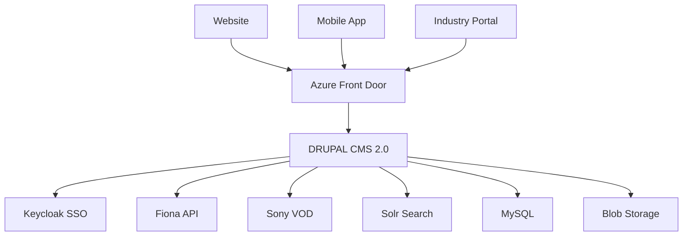
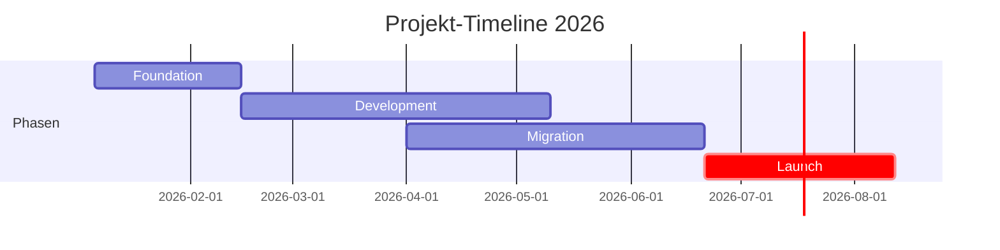

# Website-Audit: Locarno Film Festival

## Executive Summary

::: info INDIKATIONSOFFERTE
**Gesamtaufwand:** 232 PT @ 1.100 EUR/PT (Blended Rate inkl. 10% Fee)
**Gesamtbetrag:** EUR 255.200 (≈ 240k CHF)
**Go-Live:** 11. August 2026
:::

::: tip PROJEKTUMFANG
8 Arbeitspakete | 232 Personentage | 8 Monate Timeline
:::

## Projekt-Übersicht

| Aspekt | Details |
|--------|---------|
| **Website** | [locarnofestival.ch](https://www.locarnofestival.ch/) |
| **Aktuelles CMS** | Magnolia CMS 6.3 (Java-basiert) |
| **Ziel-CMS** | **Drupal CMS 2.0** (empfohlen) |
| **Umfang** | 1.700-2.200 Seiten + 10.000+ Film-Archive |
| **Sprachen** | EN, IT, FR, DE (4 Sprachen) |
| **Peak-Last** | 5.000 Anfragen/Minute |
| **Timeline** | 8 Monate (Januar - August 2026) |


## Systemlandschaft



## Key Findings

### ✅ CMS-Empfehlung: Drupal CMS 2.0

| Metrik | Wert |
|--------|------|
| **Lizenzkosten** | EUR 0 (Open Source) |
| **22 Recipes** | SEO, A11y, Forms, Media, etc. |
| **Entwicklungszeit** | 232 PT |
| **Tagessatz** | 1.100 EUR/PT (inkl. 10% Fee) |

### 📊 Kostenübersicht (Indikation)

| Position | PT | EUR |
|----------|-----|-----|
| Azure einrichten und aufsetzen | 13 | 14.300 |
| CMS installieren und einrichten | 15 | 16.500 |
| CMS Webpublishing Umsetzung Website | 78 | 85.800 |
| APIs anbinden (Fiona, Sony VOD, Mobile) | 30 | 33.000 |
| Registration und Anmelden (Keycloak) | 8 | 8.800 |
| Datenintegration bisheriger Website | 40 | 44.000 |
| Dokumentation und Bereitstellen GitHub | 5 | 5.500 |
| Projektleitung, Testing, Bugfix, Performance | 43 | 47.300 |
| **TOTAL** | **232 PT** | **EUR 255.200** |

### 🔌 Externe Integrationen

| Integration | Kritikalität | PT |
|-------------|--------------|-----|
| [Keycloak oAuth2](/integrationen/keycloak) | Hoch | 8 |
| [Fiona Festival API](/integrationen/fiona-api) | **KRITISCH** | 12 |
| [Sony VOD Streaming](/integrationen/sony-vod) | Hoch | 8 |
| [Mobile App REST API](/integrationen/mobile-api) | Hoch | 10 |
| [Solr Enterprise Search](/integrationen/solr) | **KRITISCH** | 8 |
| [CloudFront CDN](/integrationen/cloudfront) | Mittel | 2 |

## Warum Drupal CMS 2.0?

### Technische Eignung

| Anforderung | Drupal CMS 2.0 | Bewertung |
|-------------|----------------|-----------|
| 5.000 req/min Peak | ✅ Mit Azure-Skalierung | Exzellent |
| 4 Sprachen | ✅ Best-in-class Multilingual | Perfekt |
| 23 Content Types | ✅ Flexible Content-Modellierung | Ideal |
| 35 Components | ✅ Paragraphs + SDC | Optimal |
| 10.000+ Film-Archiv | ✅ Search API + Solr | Skaliert |

### OOTB Recipes (22 Stück)

```
✅ SEO Recipe          ✅ Accessibility Recipe    ✅ Media Recipe
✅ Forms Recipe        ✅ Navigation Recipe       ✅ Content Editor Recipe
✅ Multilingual        ✅ Cookie Consent          ✅ Search Recipe
```

### adessoCMS Baseline-Vorteil

- ✅ Mercury Theme mit Tailwind CSS
- ✅ Storybook-Integration für Components
- ✅ DDEV-Entwicklungsumgebung
- ✅ Testing-Framework (PHPUnit, Playwright)
- ✅ Deployment-Pipeline-Templates
- ✅ Accessibility-Foundation (WCAG 2.1 AA)

## Quick Stats

<div class="stats-grid">
  <div class="stat">
    <h3>1.700-2.200</h3>
    <p>Seiten zu migrieren</p>
  </div>
  <div class="stat">
    <h3>10.000+</h3>
    <p>Film-Archiv-Einträge</p>
  </div>
  <div class="stat">
    <h3>23</h3>
    <p>Content Types</p>
  </div>
  <div class="stat">
    <h3>35</h3>
    <p>Components (Paragraphs)</p>
  </div>
  <div class="stat">
    <h3>4</h3>
    <p>Sprachen (EN/IT/FR/DE)</p>
  </div>
  <div class="stat">
    <h3>8.000</h3>
    <p>Anfragen/Minute (Peak)</p>
  </div>
</div>

## Aktueller Website-Status

### Performance (Gut ✓)

- **LCP:** 364ms (Ziel: <2.500ms) ✅ **Exzellent**
- **CLS:** 0.0 (Perfekt!) ✅
- **TTFB:** 53ms ✅ **Sehr gut**

**Hauptprobleme:**
- ⚠️ 6 MB Vimeo-Video-Autoload
- ⚠️ Keine WebP-Bilder
- ⚠️ Font-Loading blockiert Render (235ms)

### Accessibility (Verbesserungsbedarf ⚠️)

**Score: 75/100** - Nicht WCAG 2.1 AA konform

**Kritische Issues:**
- ❌ Kein Skip-Navigation-Link
- ❌ Fehlendes `<main>` Landmark
- ❌ 40% Bilder ohne Alt-Text (29 von 72)
- ❌ Alle Formular-Inputs ohne Labels

**Aufwand für Fixes:** 54 Stunden

## Timeline & Meilensteine



| Meilenstein | Datum |
|-------------|-------|
| M1: Kickoff | 06.01.2026 |
| M2: Foundation Complete | 14.02.2026 |
| M5: Integrations Complete | 09.05.2026 |
| M6: Migration Complete | 20.06.2026 |
| M8: Beta Launch | 01.08.2026 |
| **M9: GO-LIVE** | **11.08.2026** |

## Dokument-Navigation

### Analyse & Planung
- [**Detaillierte Zusammenfassung**](/zusammenfassung) - Vollständige Analyse
- [**CMS-Vergleich**](/cms-vergleich/) - Drupal vs. Umbraco vs. Magnolia
- [**Azure-Architektur**](/hosting/azure) - Infrastruktur für 5k req/min

### Integrationen
- [**Integrationen Übersicht**](/integrationen/) - Systemlandschaft
- [**Keycloak SSO**](/integrationen/keycloak) - oAuth2 Authentication
- [**Fiona Festival API**](/integrationen/fiona-api) - Events & Screenings
- [**Sony VOD**](/integrationen/sony-vod) - Video Streaming

### Projekt
- [**Timeline & Meilensteine**](/migration/timeline) - 8 Monate Plan
- [**Risiken & Mitigation**](/migration/risiken) - 12 identifizierte Risiken
- [**Team & Ressourcen**](/projekt/team) - Rollen & Skills
- [**KPIs & Erfolgskriterien**](/projekt/kpis) - Messung & Reporting

### Kosten
- [**Indikationsofferte**](/kosten/offerte) - Kundenofferte
- [**Kostenschätzung**](/kosten/schaetzung) - Detaillierte Aufschlüsselung
- [**ROI & TCO**](/kosten/roi) - 5-Jahres-Berechnung

---

<div class="contact-info">

**Erstellt von:** Marc Philipps, Solutions Lead for Drupal @ adesso SE
**Zertifizierungen:** Triple Certified Drupal 10 Expert (Developer, Backend, Frontend)
**Datum:** 13. November 2025
**Version:** 1.0

</div>

<style>
.stats-grid {
  display: grid;
  grid-template-columns: repeat(auto-fit, minmax(150px, 1fr));
  gap: 1rem;
  margin: 2rem 0;
}

.stat {
  padding: 1.5rem;
  background: var(--vp-c-bg-soft);
  border-radius: 8px;
  text-align: center;
}

.stat h3 {
  margin: 0;
  font-size: 2rem;
  color: var(--vp-c-brand);
}

.stat p {
  margin: 0.5rem 0 0 0;
  font-size: 0.9rem;
  color: var(--vp-c-text-2);
}

.contact-info {
  margin-top: 3rem;
  padding: 1.5rem;
  background: var(--vp-c-bg-soft);
  border-left: 4px solid var(--vp-c-brand);
  border-radius: 4px;
}

.contact-info p {
  margin: 0.25rem 0;
}
</style>
