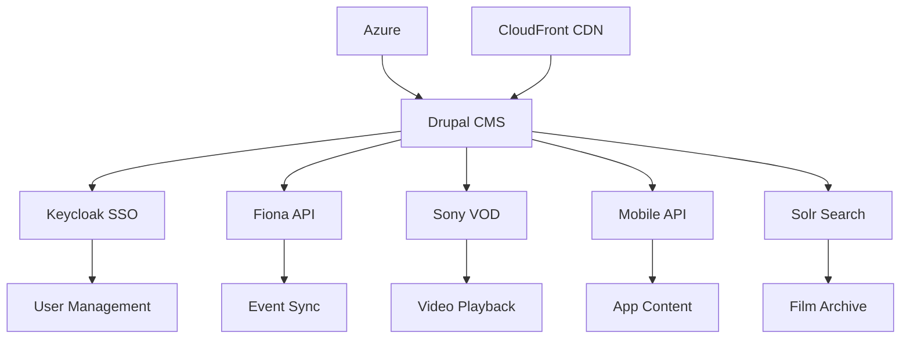

# Externe Integrationen

::: warning ZUSÄTZLICHER AUFWAND
Diese 7 Integrationen sind **Tender-Anforderungen** und erfordern **61 PT zusätzlich** (~CHF 77.000).
:::

## Systemlandschaft

```
┌─────────────────────────────────────────────────────────────┐
│                    LOCARNO WEBSITE                          │
│                    (Drupal CMS 2.0)                         │
├─────────────────────────────────────────────────────────────┤
│                                                             │
│  ┌─────────────┐  ┌─────────────┐  ┌─────────────┐        │
│  │  Keycloak   │  │  Fiona API  │  │  Sony VOD   │        │
│  │  (oAuth.2)  │  │  (Events)   │  │  (sVOD/fVOD)│        │
│  └──────┬──────┘  └──────┬──────┘  └──────┬──────┘        │
│         │                │                │                │
│  ┌──────┴────────────────┴────────────────┴──────┐        │
│  │              Drupal Integration Layer          │        │
│  └───────────────────────┬───────────────────────┘        │
│                          │                                 │
│  ┌───────────────────────┴───────────────────────┐        │
│  │              Mobile App (REST API)             │        │
│  └───────────────────────────────────────────────┘        │
│                                                             │
├─────────────────────────────────────────────────────────────┤
│                    INFRASTRUCTURE                           │
│  ┌─────────────┐  ┌─────────────┐  ┌─────────────┐        │
│  │   Azure     │  │  CloudFront │  │    Solr     │        │
│  │  (Hosting)  │  │   (CDN)     │  │  (Search)   │        │
│  └─────────────┘  └─────────────┘  └─────────────┘        │
└─────────────────────────────────────────────────────────────┘
```

## Übersicht aller Integrationen

| # | Integration | PT | Budget | Priorität |
|---|-------------|-----|--------|-----------|
| 1 | [Azure Infrastructure](/hosting/azure) | 13 | CHF 16.250 | **KRITISCH** |
| 2 | [Keycloak oAuth.2](/integrationen/keycloak) | 8 | CHF 10.000 | **HOCH** |
| 3 | [Fiona Festival API](/integrationen/fiona-api) | 12 | CHF 15.000 | **KRITISCH** |
| 4 | [Sony VOD Streaming](/integrationen/sony-vod) | 8 | CHF 10.000 | **HOCH** |
| 5 | [CloudFront CDN](/integrationen/cloudfront) | 2 | CHF 2.500 | MITTEL |
| 6 | [Mobile App REST API](/integrationen/mobile-api) | 10 | CHF 12.500 | **HOCH** |
| 7 | [Solr Enterprise Search](/integrationen/solr) | 8 | CHF 10.000 | **KRITISCH** |
| | **TOTAL** | **61** | **CHF 76.250** | |

## Abhängigkeiten



## Kritische Erfolgsfaktoren

1. **Frühe API-Klärung** - Fiona und Sony APIs müssen in Discovery-Phase dokumentiert werden
2. **Keycloak-Zugang** - Testzugang zum bestehenden Keycloak für Entwicklung erforderlich
3. **Azure-Subscription** - Muss vor Entwicklungsstart bereitstehen
4. **Mobile App Koordination** - API-Specs müssen mit App-Team abgestimmt werden

## Empfohlene Reihenfolge

```
Phase 1: Infrastructure & Auth (Wochen 1-4)
├── Azure Setup (13 PT)
└── Keycloak Integration (8 PT)

Phase 2: External Integrations (Wochen 5-8)
├── Fiona API (12 PT)
└── Sony VOD (8 PT)

Phase 3: Search & API (Wochen 9-12)
├── Solr Setup (8 PT)
├── Mobile API (10 PT)
└── CloudFront (2 PT)
```

---

[→ Keycloak oAuth.2](/integrationen/keycloak)
[→ Fiona Festival API](/integrationen/fiona-api)
[→ Sony VOD Streaming](/integrationen/sony-vod)
